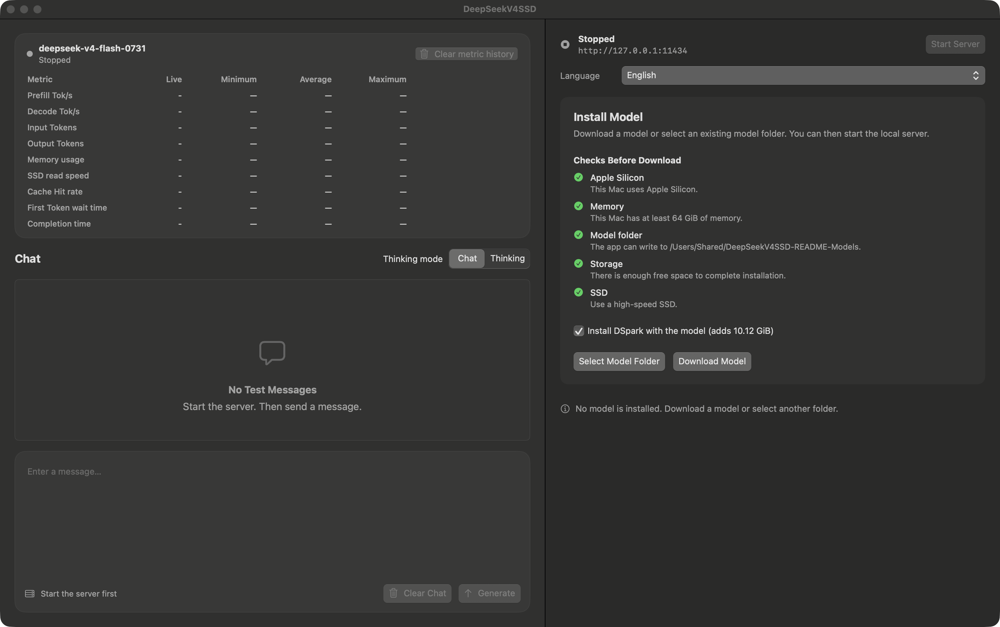

# Whallm

<p align="center">
  
</p>

<p align="center">
  <a href="README.md"></a>
  <a href="README-tw.md"></a>
  <a href="README-cn.md"></a>
  <a href="README-ja.md"></a>
  <a href="README-ko.md"></a>
</p>

> [!NOTE]
> Whallm 的舊名稱是 DeepSeekV4SSD。改名前發布的 release 仍使用舊 APP 與 ZIP 名稱。

Whallm 讓 M 系列 Mac 執行 `DeepSeek-V4-Flash-0731` 的全部 284B 參數。
Whallm 從 SSD 串流 routed expert。
Whallm 也支援 `Qwen3.8-Flash-Next-FP8` text checkpoint。
本專案的設計啟發自 [Turbo Fieldfare](https://github.com/drumih/turbo-fieldfare)。

## 峰值記憶體參考

| 模型 | 量測到的峰值記憶體 |
| --- | ---: |
| `DeepSeek-V4-Flash-0731` | 23.03–35.64 GiB |
| `Qwen3.8-Flash-Next-FP8` | 15.19–18.92 GiB |

v1.1.0 測試使用 1,024 到 16,384 個 input token 的對話 prompt。
這些結果是量測值。這些結果不是最低記憶體需求，也不是效能保證。
prompt 長度、tool、cache 狀態和 runtime 設定會改變峰值記憶體。
請參閱[完整 Benchmark](BENCHMARK.md)和[完整驗證紀錄](docs/VALIDATION.md)。

## Benchmark

v1.1.0 測試在配備 Apple M5 Pro、64 GB 統一記憶體和 1 TB 儲存空間的
MacBook Pro 執行。兩個模型都使用 `reasoning_effort: low` 和
`thinking_mode: chat`。TTFT 表示第一個 token 的等待時間。

### DeepSeek V4 Flash 0731

| Input token | P95 總時間 | P95 TTFT | P95 Prefill | P95 Decode | 峰值記憶體 |
| ---: | ---: | ---: | ---: | ---: | ---: |
| 1,024 | 46.72 s | 37.26 s | 20.7 tok/s | 6.7 tok/s | 23.03 GiB |
| 2,048 | 27.08 s | 16.91 s | 108.1 tok/s | 6.6 tok/s | 33.19 GiB |
| 8,192 | 47.66 s | 37.96 s | 209.5 tok/s | 6.7 tok/s | 34.74 GiB |
| 16,384 | 86.01 s | 76.34 s | 212.3 tok/s | 6.7 tok/s | 35.64 GiB |

### Qwen3.8 Next Flash FP8

| Input token | P95 總時間 | P95 TTFT | P95 Prefill | P95 Decode | 峰值記憶體 |
| ---: | ---: | ---: | ---: | ---: | ---: |
| 1,024 | 24.45 s | 17.20 s | 59.8 tok/s | 9.3 tok/s | 15.19 GiB |
| 2,048 | 40.45 s | 32.63 s | 65.0 tok/s | 8.3 tok/s | 16.41 GiB |
| 8,192 | 142.39 s | 134.44 s | 61.7 tok/s | 8.3 tok/s | 17.90 GiB |
| 16,384 | 276.41 s | 267.88 s | 61.8 tok/s | 7.8 tok/s | 18.92 GiB |

prompt、SSD 速度和 cache 狀態會改變效能。請參閱
[完整 Benchmark](BENCHMARK.md)和[完整驗證紀錄](docs/VALIDATION.md)。

## 如何使用

**下載 APP → 開啟 APP → 選擇並下載模型 → 啟動 server →
在 APP 對話或連接 Codex**

> [!IMPORTANT]
> 1.0.3 版無法透過自動更新安裝 1.0.4 版，因為舊的 Sparkle signing key
> 已無法使用。請結束 APP，從
> [1.0.4 release](https://github.com/yanun0323/deepseek_ssd/releases/tag/v1.0.4)
> 下載 `DeepSeekV4SSD-macOS-arm64.zip`，然後手動取代現有 APP。
> 安裝 1.0.4 版後，自動更新會恢復正常。

1. 從 [GitHub Releases](https://github.com/yanun0323/deepseek_ssd/releases/latest)
   下載最新的 `Whallm-macOS-arm64.zip`。
2. 解壓縮 ZIP。開啟 `Whallm.app`。
3. 開啟「模型」頁面。選擇 DeepSeek 或 Qwen，然後選擇「下載模型」。APP 會檢查
   所需儲存空間。Qwen 會下載已發布的 MXFP4 installed model。使用者可以停止下載，
   之後再繼續下載。
4. 開啟「Server」頁面，然後選擇「啟動 server」。server 可以在沒有 installed model
   時啟動。generation request 必須使用 installed model。
5. 開啟對話頁面並選擇模型。使用者也可以使用下方設定連接 Codex。

預設本機 server 位址是 `http://127.0.0.1:11434`。



## 使用需求

| 項目 | 需求 |
| --- | --- |
| Mac | Apple Silicon M 系列 Mac |
| macOS | macOS 15 或更新版本 |
| 統一記憶體 | 64 GiB 或更多 |
| 可用儲存空間 | APP 會檢查所選模型和現有的部分下載 |
| 模型儲存裝置 | 高速內接、Thunderbolt 或 USB4 SSD |
| 網路 | 下載模型和 APP 更新時需要網路 |

> [!IMPORTANT]
> Whallm 是實驗性軟體。APP 不包含模型權重。除非其他裝置必須
> 連線，否則請保留預設本機 server 位址。

## Codex `config.toml` 配置

先在 Whallm 啟動 server。然後把下列設定加入
`~/.codex/config.toml`：

```toml
model = "deepseek-v4-flash-0731"
model_provider = "deepseek-v4-ssd"
model_reasoning_effort = "high"

[model_providers.deepseek-v4-ssd]
name = "Whallm"
base_url = "http://127.0.0.1:11434/v1"
wire_api = "responses"
requires_openai_auth = false
```

儲存檔案後，請重新啟動 Codex。本機位址不需要 API key。provider 設定
必須放在使用者層級的設定檔。[Codex 官方配置參考](https://developers.openai.com/codex/config-reference/)
包含其他設定。

## 其他技術細節

### 運作方式

- main model 具有 284B 總參數。每個 token 約會啟用 13B 參數。
- runtime 會把 common tensor 保留在統一記憶體中。
- routed expert 使用 checkpoint 原生 FP4 權重。runtime 會在需要時從
  SSD 讀取 routed expert。
- runtime 使用 FP8 KV cache 和有容量上限的 expert cache 控制記憶體用量。
- installed model 必須通過固定 checkpoint revision 的驗證。
- server 啟動時只讀取 installed model 清單。server 啟動時不載入模型權重。
- 第一個 generation request 會載入指定模型。
- server 一次只保留一個已載入模型。request 指定另一個模型時，server 會先關閉
  舊 runtime，然後載入新 runtime。
- 使用者可以在「模型」頁面載入或卸載模型。已載入的模型會移到「已載入」區段。
- 使用者可以調整 DeepSeek layer-major Prefill 門檻。預設值是 1,024 個未快取的
  prompt token。

### 模型儲存空間與 DSpark

- main model 約使用 145 GiB。
- DSpark 會增加約 10.12 GiB。每次新的 DeepSeek 下載都會安裝 DSpark。
- 安裝 DSpark 不會啟用 DSpark。使用者可以在 runtime 設定中啟用
  「使用 DSpark」來測試 speculative decoding。
- 使用者可以移除 DSpark。移除 DSpark 不需要重新安裝 main model。
- Qwen installed weight 檔案使用 125,268,506,112 bytes。Qwen 不支援 DSpark。
- Qwen 會下載已驗證的 MXFP4 installed model。模型安裝程序不會在使用者的 Mac
  上量化 Qwen checkpoint。

### OpenAI 相容 server

server 支援下列 endpoint：

- `GET /healthz`
- `GET /v1/models`
- `POST /v1/responses`
- `POST /v1/chat/completions`
- `POST /v1/completions`
- `POST /api/models/load`
- `POST /api/models/unload`

固定 API model ID 是 `deepseek-v4-flash-0731` 和
`qwen3.8-flash-next-fp8`。每個模型的「進階設定」頁面可以設定選用的 Alias。
有效的變更會自動儲存。generation request 接受 API model ID 或 Alias。
對話模型選單只顯示 server 啟動時可用的 installed model。如果下載在 server
執行期間完成，使用者必須重新啟動 server。

Responses API 支援 Codex tool 和 OpenAI function tool。API client 必須執行
tool，然後把結果傳回 server。[API 指南](docs/API.md)包含 request 欄位、
範例和目前限制。

### 指標與隱私

APP 會顯示 prefill 速度、decode 速度、token 數量、記憶體用量、SSD 讀取速度、
cache hit rate、第一個 token 等待時間和完成時間。載入的模型切換時，APP 會清除
指標歷史。

runtime 會在 Mac 上執行推論。prompt 和生成文字會保留在本機 runtime。
連接的 API client 仍可能把資料傳送到其他位置。APP 會使用網路下載模型、
檢查更新和接收已設定的 API request。

### 目前限制

- runtime 只支援目前文件中的兩個固定 checkpoint revision。
- Qwen 只支援文字。Qwen 不支援 vision、video、MTP 和 DSpark。
- Qwen 已在記錄的 M5 Pro 環境通過完整模型 SHA-256、文字、thinking、tool call、
  greedy 4K、prompt cache 和 packaged APP 驗證。請參閱
  [Qwen 支援狀態](docs/QWEN.md)。
- server 一次只保留一個已載入模型。server 一次只處理一個 generation request。
  其他 generation request 會等待目前 request stream 完整結束。
- API 不支援圖片、音訊、logprobs、`response_format` 和 `stop`。
- server 將 request body 限制為 1 MiB。
- 很長的 input 和 output 需要更多 KV cache 記憶體。
- 效能取決於 SSD 速度、input 長度和 cache 狀態。

[目前文件](docs/README.md)包含模型合約、runtime 設計、驗證、效能和研究結論。

Whallm 與 DeepSeek 沒有從屬關係。下載和使用模型前，請先閱讀模型條款。

## 授權

Whallm 原始碼依照 [MIT License](LICENSE)開放。專案不包含模型權重。
模型權重適用個別條款。
